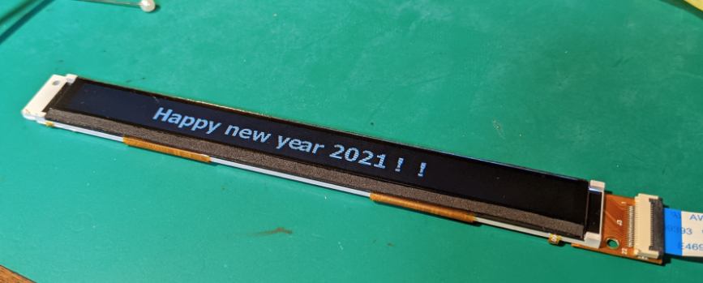
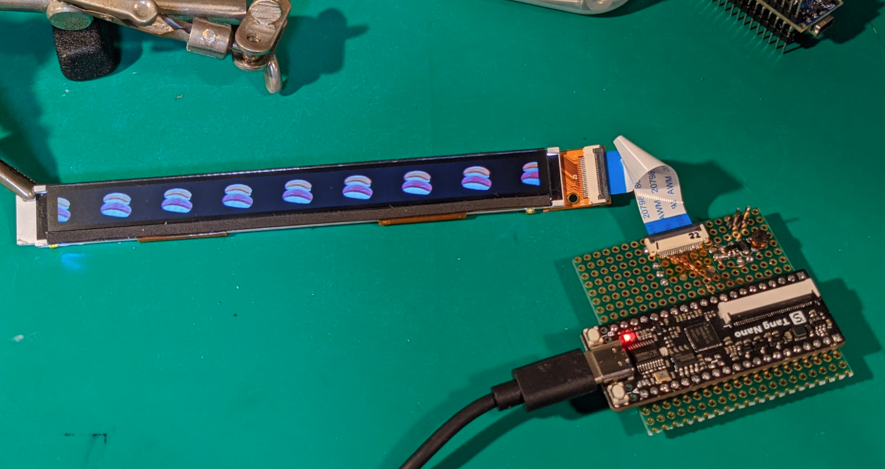

# TFT_Test_48x640

某魔法ステッキに内蔵されている48x640ピクセルLCDをArduino NanoとTang-Nano FPGAで動かしてみたサンプルです。実機動作を元に初期化コードなどを記述しているつもりですが、誤り等あるかもです。予めご了承ください。  
詳細は[wiki](https://github.com/htlabnet/inside_magimajopures/wiki)参照。  

## Arduino Nano版
Arduino NanoのI/O電圧は5Vですが、本LCDの信号レベルは3.3V系です。実験ではArduinoの電源電圧を3.3Vに下げて動作させてます。  
  

## Tang Nano版
Arduino Nanoで🍣を流そうとしたところ、処理速度が足りずに残念な感じになったので、Tang-Nano FPGAに移植してみました。  
  
